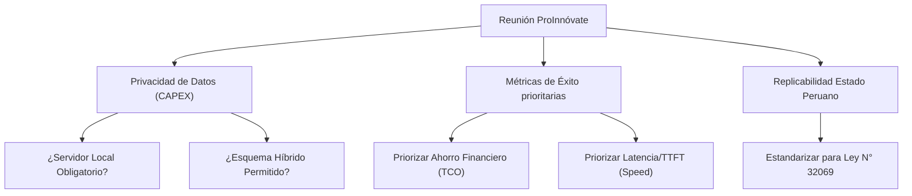

# Registro de Progreso del Proyecto: Portal de Decisiones MLOps (Osinergmin)

Este documento registra de manera detallada el progreso del desarrollo del **Selector de Modelos de IA Generativa — Portal de Decisiones MLOps**, enfocado en la auditoría de Términos de Referencia (TDR) regulatorios bajo la Ley N° 32069 en Osinergmin (Perú).

---

## 📌 1. Avances de Desarrollo Implementados

Se han consolidado múltiples mejoras de infraestructura, matemáticas de estimación y ergonomía visual para llevar el simulador a un nivel de producción robusto:

### A. Reorganización y Limpieza de Interfaz (`app.py`)
*   **Pestañas de Navegación Compactas:** Se eliminaron los contenedores expandibles gigantes (`st.expander`) que dominaban la parte superior de la página, liberando espacio vertical.
*   **Pestaña Centralizada de Configuración:** Se creó la pestaña **`🎛️ Filtros y Configuración`** al lado de la clasificación de modelos, dividida en dos columnas:
    *   *Columna Izquierda:* Preferencias de negocio (despliegue local/cloud/híbrido) y sliders de ponderación de pesos de la fórmula de clasificación.
    *   *Columna Derecha:* Parámetros físicos del motor local (GPUs, TP, VRAM util, vLLM/SGLang, batching, chunked prefill) y la nueva configuración de **Caché de Prompts**.
*   **Tabla de Clasificación Limpia:** Se ocultaron las columnas técnicas redundantes de **"Alojamiento"** y **"Atención"** de la tabla principal para evitar la sobrecarga cognitiva.

### B. Corrección de Errores Críticos de Cálculo (Overflow de Eficiencia)
*   **Identificación del Bug:** La API de OpenRouter devuelve valores   centinela de `-1` en los campos de precio para modelos con enrutamiento dinámico (ej: `openrouter/fusion`). Al multiplicar por un millón, esto generaba un costo de entrada de `-$1,000,000.00`, desbordando la fórmula de eficiencia de Cloud/Híbrida por encima de los 28 millones por ciento.
*   **Solución:**
    *   Se implementó saneamiento en `logic.py` para mapear precios negativos de API a `0.0`.
    *   Se aplicó doble validación en `app.py` utilizando `max(0.0, cost)` para neutralizar valores heredados corruptos.
    *   Se acotaron de forma estricta los puntajes calculados utilizando `min(100.0, max(0.0, score))` garantizando que ninguna métrica de scoring salga del rango estándar del **0% al 100%**.

### C. Reubicación Didáctica de Arquitecturas de Atención
*   **Explicador Dinámico Contextual:** La columna "Atención" (MHA, GQA, MLA) se retiró de la tabla general y se colocó en la sección de *🎯 Validación y Simulación de Infraestructura*.
*   Al seleccionar un modelo específico, se muestra un panel explicativo azul con la identidad visual corporativa de Osinergmin detallando:
    *   **MLA (Multi-Head Latent Attention):** Cómo comprime el KV Cache y reduce en 90% el consumo de VRAM por usuario (ej: DeepSeek).
    *   **GQA (Grouped-Query Attention):** Su balance en modelos estándar como Llama 3 o Mistral.
    *   **MHA (Multi-Head Attention):** Las ineficiencias de escalado de VRAM en modelos antiguos.

### D. Ingestión Dinámica de Costos de Caching (Cero Hardcoding)
*   **Ingesta Real de API:** Se descartó el uso de constantes hardcodeadas para los descuentos de caché. Ahora, `logic.py` consulta en tiempo real los campos `input_cache_read` y `input_cache_write` desde la API de OpenRouter (150 modelos reportan costos de lectura de caché activos y 45 reportan recargos de escritura).
*   **Fórmulas Amortizadas y Fallbacks:** Se implementó la fórmula analítica de TCO para la amortización conversacional en `app.py`:
    $$C_{\text{input\_efectivo}} = \frac{C_{\text{escritura}} + (N - 1) \cdot \left(H \cdot C_{\text{lectura}} + (1 - H) \cdot C_{\text{escritura}}\right)}{N}$$
    *   *Fallback Neutro:* Si un modelo no provee datos de caché, el sistema asigna $C_{\text{lectura}} = C_{\text{escritura}} = C_{\text{base}}$, lo cual simplifica la ecuación de forma exacta a $C_{\text{input\_efectivo}} = C_{\text{base}}$, asegurando neutralidad en la puntuación sin errores de división o excepciones.

### E. Integración de Tooltip MLOps Educativo
*   Se incorporó un tooltip explicativo en el slider de **Tasa de Acierto de Caché (Hit Rate %)**, guiando al usuario sobre cuándo usar valores altos (RAG estático sobre TDRs largos: 70-90%) y cuándo valores bajos (RAG dinámico: 0-20%), considerando también el límite teórico dado por $\frac{N-1}{N}$ y el TTL de expiración por inactividad.

### F. Independencia de Pesos de Negocio, Ponderación Fina de Benchmarks y Restricciones Blandas
*   **Ponderación Plana e Independiente (Sin Redundancia):** Se eliminó el slider de nivel superior "Peso de Calidad Técnica" por ser redundante. Ahora todas las métricas (benchmarks de calidad IFEval, MMLU, GPQA, y atributos de hardware/costo Velocidad, Eficiencia, Tamaño) se configuran en un único nivel de ponderación plano e independiente (no restrictivo/suma cero).
*   **Puntaje Final Plano Normalizado:** El puntaje final se calcula como el promedio ponderado plano de todas las métricas activas según los pesos asignados por el usuario.
*   **Penalización por Tamaño de Parámetros:** Se introdujo un slider de peso de tamaño de modelo. Al aumentar este valor, se penaliza a los modelos grandes y se beneficia a los modelos más ligeros y eficientes en la clasificación final.
*   **Flexibilización de Restricciones Físicas (Blandas):** Se eliminó el bloqueo estricto de compatibilidad por VRAM física. Los modelos locales que excedan la memoria local disponible de la GPU ya no son forzados como incompatibles o enviados al final de la tabla de forma binaria. En su lugar, el exceso se reporta informativamente como `⚠️ VRAM Excedida` (en rojo bold) y la clasificación final se calcula de forma blanda mediante la penalización de tamaño y el score de eficiencia de VRAM.
*   **Cálculo de Calidad Resiliente:** Si a un modelo le falta algún benchmark (ej: GPQA no reportado), el sistema ya no le asigna `0.0` de calidad. En su lugar, calcula el promedio ponderado dinámico considerando únicamente los pesos de los benchmarks activos y presentes.

---

## 📋 2. Estado de Variables y Decisiones Abiertas (Gaps)

A pesar de los avances, existen definiciones arquitectónicas y de negocio que deben alinearse, en particular tras la reunión con el **Equipo ProInnóvate**:

### 🔴 Brechas Críticas y Puntos de Decisión Pendientes

1.  **Soberanía de Datos vs. Costos Operativos (OPEX):**
    *   *Vacío:* ¿Permite el área legal de Osinergmin procesar documentos de contratación pública en APIs de nube extranjeras, o la ley exige alojamiento estricto en suelo peruano (servidor físico)? 
    *   *Impacto MLOps:* Si el alojamiento local es obligatorio, el recomendador filtrará automáticamente todos los modelos de nube, perdiendo la ventaja del TCO ultra bajo de modelos como DeepSeek R1 API.
2.  **Calibración de Pesos de Negocio por Defecto:**
    *   *Vacío:* Actualmente, los pesos de Calidad Técnica, Velocidad y Eficiencia están balanceados equitativamente. Necesitamos definir perfiles por defecto para Osinergmin (ej. un preset "Cumplimiento Legal" que priorice Calidad al 80% y otro "Alta Concurrencia" que priorice Velocidad/Eficiencia).
3.  **Simulación de Prefix Caching Local en el Simulador de Latencia:**
    *   *Vacío:* La caché de prompts en local (RadixAttention en SGLang) reduce la latencia de prellenado (TTFT). Actualmente, el modelo Roofline en local estima el TTFT de forma lineal. 
    *   *Siguiente Paso:* Debemos refinar la simulación de rendimiento local para que, si se selecciona un motor local y el hit rate de caché es $>0$, la latencia TTFT local estimada disminuya dinámicamente un 80% en la tabla de comparación.

---

## 🚀 3. Próximos Pasos Técnicos

1.  **Ajuste del TTFT Local con Caché:** Incorporar el colapso de complejidad computacional en el estimador de rendimiento físico local (`calculate_roofline_local_performance`) cuando el usuario tiene activo el *Prefix Caching*.
2.  **Visualizador Gráfico de Sensibilidad TCO:** Agregar un gráfico de líneas dinámico (usando `st.line_chart` o Plotly) en el desglose de APIs que muestre la curva de costos mensuales proyectados en función de la variación de la Tasa de Acierto de Caché (de 0% a 100%).
3.  **Mapeo de Límites de Contexto Físicos:** Agregar una validación visual que alerte si los documentos a procesar exceden el límite de ventana de contexto del modelo seleccionado (especialmente para Gemini y Claude).
